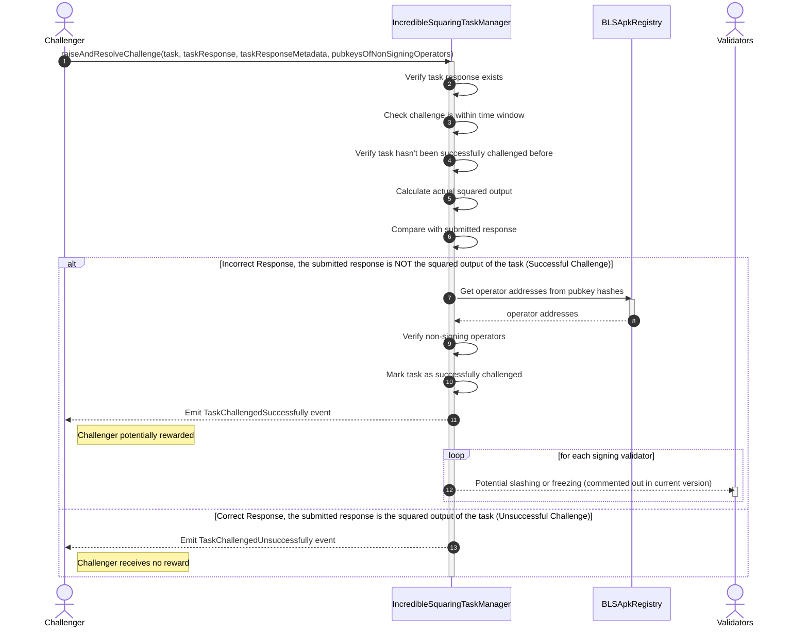

## RaiseAndResolveChallenge

A task challenger raises a challenge on a task response, and the task manager resolves the challenge. Here, is the flow of the challenge resolution process. It includes:

- Verify task response exists
- Check challenge is within time window
- Verify task hasn't been successfully challenged before
- Calculate actual squared output
- Compare with submitted response
- Get operator addresses from pubkey hashes
- Verify non-signing operators

**Successful Challenge**
- Mark task as successfully challenged
- Emit TaskChallengedSuccessfully event
- Potential slashing or freezing of validators (commented out in current version)

**Unsuccessful Challenge**
- Emit TaskChallengedUnsuccessfully event (Challenger receives no reward)

---

